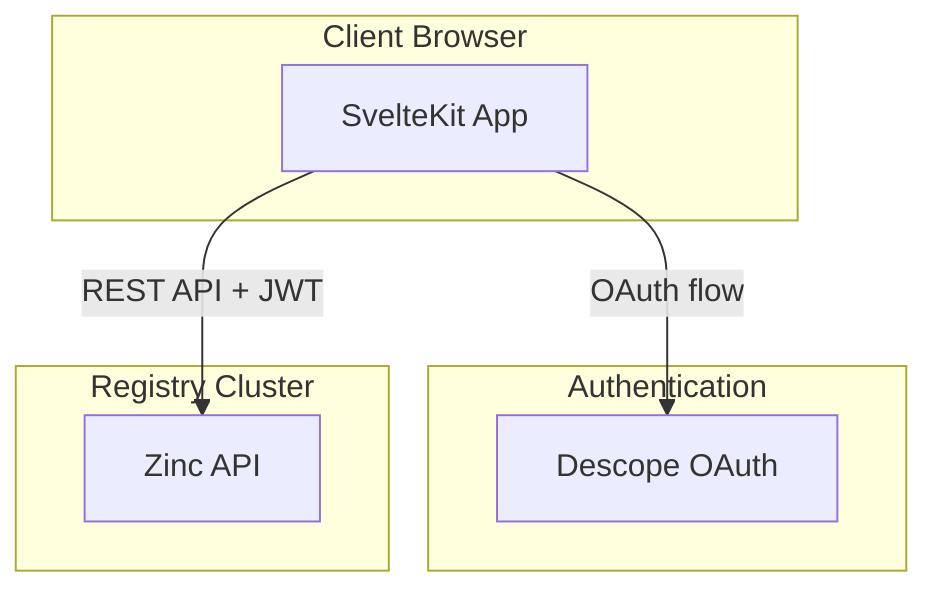
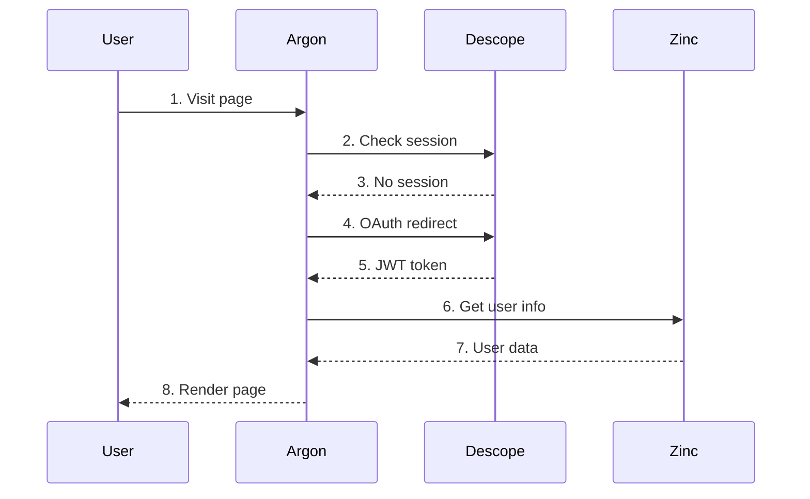

# Architecture

High-level system overview for Argon.

## Overview

Argon is a SvelteKit application that provides a web interface for the CyanPrint registry. It communicates with the Zinc backend API via a generated TypeScript client, handles authentication through Descope OAuth, and renders templates, plugins, and processors for users to discover and use.

## System Components



## Component Interaction



| #   | Step           | What                      | Key File                             |
| --- | -------------- | ------------------------- | ------------------------------------ |
| 1   | Visit page     | User navigates to any URL | `src/routes/+layout.svelte`          |
| 2   | Check session  | Server validates session  | `src/routes/+layout.server.ts`       |
| 3   | No session     | User not authenticated    | `src/hooks.server.ts`                |
| 4   | OAuth redirect | Redirect to Descope       | `@auth/sveltekit/client`             |
| 5   | JWT token      | Receive access token      | `src/hooks.server.ts:29-38`          |
| 6   | Get user info  | Fetch from Zinc API       | `src/routes/+layout.server.ts:25-28` |
| 7   | User data      | User profile and metadata | `src/lib/api/core/Api.ts`            |
| 8   | Render page    | Display UI with data      | `src/routes/+page.svelte`            |

## Key Design Decisions

### SvelteKit with Server-Side Rendering (SSR)

**What**: Use SvelteKit with SSR enabled

**Why**:

- SEO-friendly: Search engines can crawl template pages
- Fast initial load: HTML renders before JavaScript loads
- Progressive enhancement: Basic navigation works without JavaScript
- Type-safe load functions for data fetching

### Auto-Generated API Client

**What**: Generate TypeScript client from Zinc OpenAPI spec using `swagger-typescript-api`

**Why**:

- Type safety: All API responses are typed
- Stays in sync: Regenerate when Zinc API changes
- No manual maintenance: Endpoints auto-generated
- Single source of truth: OpenAPI spec drives both backend and frontend

### Descope for Authentication

**What**: Use Descope as OAuth 2.0 / OpenID Connect provider

**Why**:

- Delegated authentication: No password storage in Argon
- Social logins: Supports multiple identity providers
- Enterprise SSO: Can scale to enterprise needs
- PKCE flow: Secure OAuth implementation

### Landscape System

**What**: Use Pokemon-named landscapes (pichu/pikachu/raichu/lapras) for environments

**Why**:

- Explicit environments: No implicit dev/prod confusion
- Type-safe config: TypeScript ensures config shape
- Compile-time inclusion: Only selected landscape bundled
- Easy reference: Memorable names for quick communication

### Result/Option Types

**What**: Use functional programming types (`Result<T, E>`, `Option<T>`) for error handling

**Why**:

- Type safety: Errors are part of function signature
- Explicit handling: Compiler forces error handling
- No exceptions: Avoids silent failures and try/catch nesting
- Immutable, composable: Functional patterns

### shadcn-svelte + bits-ui

**What**: Use shadcn-svelte design patterns with bits-ui headless primitives

**Why**:

- Accessibility: Headless components with ARIA support
- Customizable: Own the components, not a black-box library
- Tailwind-based: Consistent styling system
- No runtime cost: Components copied into project

## File-Based Routing

**Structure**: SvelteKit file-based routing in `src/routes/`

**Patterns**:

- `+layout.svelte` → Wrapper for all child routes
- `+layout.server.ts` → Data loading for layout
- `+page.svelte` → Page component
- `+page.server.ts` → Server-side data loading
- `[param]` → Dynamic route parameters

**Example**: `/templates/[user_id]/[template_id]`

- `src/routes/templates/[user_id]/[template_id]/+page.ts` → Loads template data
- `src/routes/templates/[user_id]/[template_id]/+page.svelte` → Renders template UI

## Component Organization

### UI Components (`src/lib/components/ui/`)

Base components from shadcn-svelte. Auto-generated via `pls add <component>`.

### Cards (`src/lib/components/cards/`)

Domain-specific components for displaying resources:

- `template.svelte` → Template summary card
- `plugin.svelte` → Plugin summary card
- `processor.svelte` → Processor summary card

### Complex Components (`src/lib/components/complex/`)

Composed components for complex UI patterns:

- `page.svelte` → Page wrapper with loading/error states
- `error.svelte` → Error display with animation
- `loader.svelte` → Loading indicator
- `revoke-button.svelte` → Token revocation button

### Custom Components (`src/lib/components/custom/`)

Business-specific components:

- `account/` → User account dropdown
- `main-nav/` → Main navigation

## Configuration Structure

Per-landscape configuration in `src/config/`:

```
src/config/
├── client/          # Browser-accessible (PUBLIC_ prefixed)
├── server/          # Server-only (can include secrets)
└── shared/          # Used by both client and server
```

Each landscape has:

- API endpoint (Zinc backend URL)
- Descope project credentials
- Feature flags

## Related

- [Features](./features/) - What this component does
- [Modules](./modules/) - Code organization
