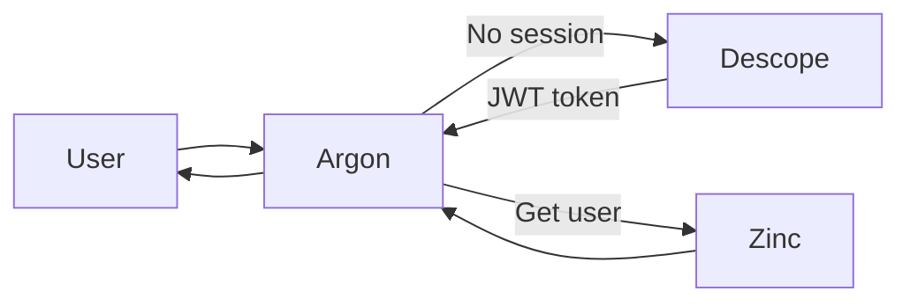
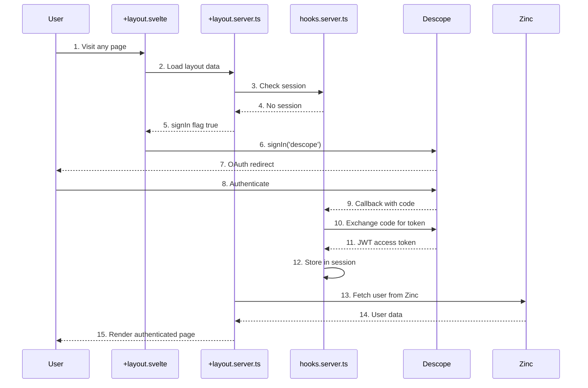

# Authentication

**What**: OAuth2/OpenID Connect authentication via Descope provider.

**Why**: Enables secure user authentication without managing credentials. Delegates authentication to a specialized provider.

**Key Files**:

- `src/hooks.server.ts:14-70` → Descope OAuth provider configuration
- `src/routes/+layout.server.ts:10-49` → Session loading and user fetching
- `src/routes/+layout.svelte:12-14` → Client-side sign-in trigger

## Overview

Argon uses Descope as an OAuth 2.0 / OpenID Connect provider for authentication. The flow follows the PKCE (Proof Key for Code Exchange) pattern for secure token exchange. When a user visits any page, the server checks for a valid session. If none exists, the user is redirected to Descope for authentication. After successful login, Descope redirects back with a JWT token that is stored in the session and used for subsequent API calls to Zinc.

## Flow

### High-Level

### Detailed

| #   | Step           | What                              | Why                            | Key File                             |
| --- | -------------- | --------------------------------- | ------------------------------ | ------------------------------------ |
| 1   | Visit page     | User navigates to any URL         | Initiate auth flow             | `src/routes/+layout.svelte`          |
| 2   | Load data      | Server loads layout data          | Check for session              | `src/routes/+layout.server.ts:10-49` |
| 3   | Check session  | SvelteKitAuth validates session   | Determine auth state           | `src/hooks.server.ts:14-70`          |
| 4   | No session     | User not authenticated            | Trigger login flow             | `src/hooks.server.ts`                |
| 5   | signIn flag    | Set auth.signIn = true            | Signal client to trigger OAuth | `src/routes/+layout.server.ts:15-17` |
| 6   | OAuth redirect | Client calls signIn()             | Redirect to Descope            | `src/routes/+layout.svelte:12-14`    |
| 7   | OAuth screen   | User sees Descope login           | User authenticates             | Descope service                      |
| 8   | Authenticate   | User enters credentials           | Prove identity                 | Descope service                      |
| 9   | Callback       | Descope redirects with code       | Exchange for token             | `src/hooks.server.ts:29-38`          |
| 10  | Exchange       | Server swaps code for JWT         | Get access token               | `src/hooks.server.ts:39-58`          |
| 11  | JWT token      | Receive access and refresh tokens | Store in session               | `src/hooks.server.ts:42-46`          |
| 12  | Store session  | Save token in session             | Use for API calls              | `src/hooks.server.ts:29-38`          |
| 13  | Fetch user     | Call Zinc API for user data       | Get user profile               | `src/routes/+layout.server.ts:25-28` |
| 14  | User data      | Zinc returns user info            | Display in UI                  | `src/lib/api/core/Api.ts`            |
| 15  | Render page    | Display authenticated UI          | User can now use app           | `src/routes/+page.svelte`            |

## Edge Cases

- **User not in Zinc**: After OAuth, user is redirected to `/register` to create username
- **Token expired**: Token refresh flow is triggered (see [Token Refresh](./02-token-refresh.md))
- **OAuth error**: Descope errors are displayed to user with redirect option

## Related

- [Token Refresh](./02-token-refresh.md) - Handling expired tokens
- [Registration](./03-registration.md) - Post-auth username creation
- [API Client](../modules/01-api-client.md) - API client with auth injection
