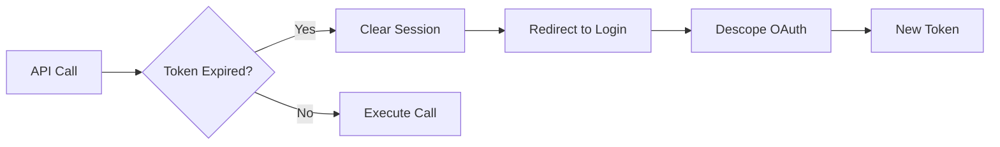
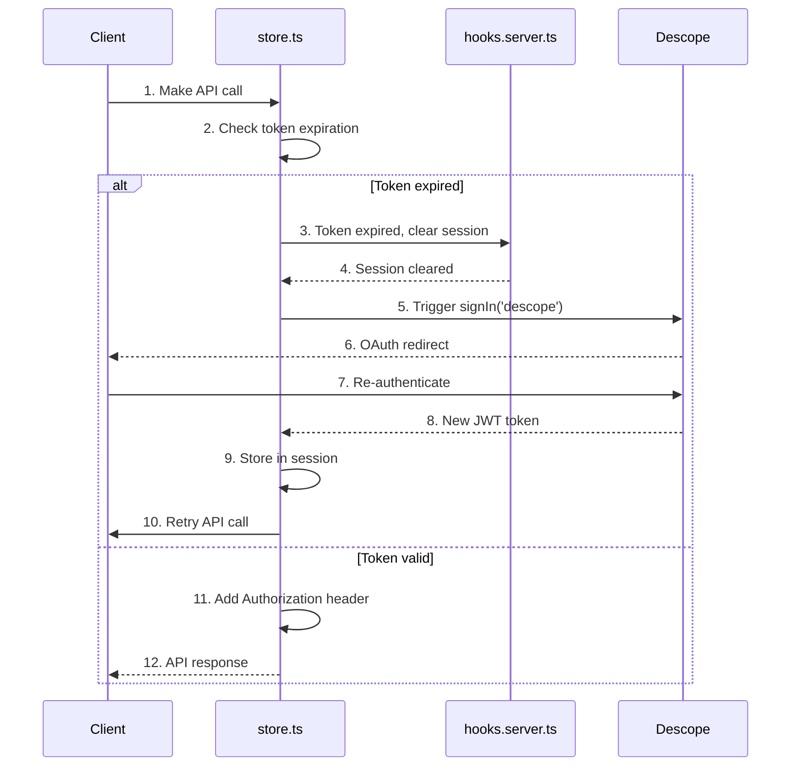

# Token Refresh

**What**: JWT token expiration checking and automatic redirect to login.

**Why**: Ensures users have valid sessions without manual token management.

**Key Files**:

- `src/hooks.server.ts:7-12` → `expired()` function for token validation
- `src/hooks.server.ts:60-66` → JWT callback that clears expired tokens
- `src/store.ts:22` → Token expiration check before API calls
- `src/store.ts:43-45` → Auto sign-in when token expired

## Overview

JWT tokens from Descope have a limited lifetime. Argon checks token expiration at multiple points: during session validation on the server, before making API calls on the client, and in the JWT callback. When a token is detected as expired, it's cleared from the session and the user is automatically redirected to Descope for re-authentication.

## Flow

### High-Level

### Detailed

| #   | Step             | What                         | Why                         | Key File                    |
| --- | ---------------- | ---------------------------- | --------------------------- | --------------------------- |
| 1   | API call         | Client makes request         | Access protected resource   | `src/store.ts:38-56`        |
| 2   | Check expiration | Validate JWT exp claim       | Ensure token is still valid | `src/store.ts:22`           |
| 3   | Clear session    | Remove expired token         | Prevent use of stale token  | `src/hooks.server.ts:60-66` |
| 4   | Session cleared  | Token removed from session   | Force re-authentication     | `src/hooks.server.ts:64-65` |
| 5   | Trigger signIn   | Redirect to Descope          | Get fresh token             | `src/store.ts:43-45`        |
| 6   | OAuth redirect   | User sees login screen       | Re-authenticate             | `@auth/sveltekit/client`    |
| 7   | Re-authenticate  | User proves identity         | Get new token               | Descope service             |
| 8   | New token        | Fresh JWT received           | Update session              | `src/hooks.server.ts:39-58` |
| 9   | Store session    | Save new token               | Use for future calls        | `src/hooks.server.ts:29-38` |
| 10  | Retry call       | Execute original request     | Complete user action        | `src/store.ts:38-56`        |
| 11  | Add header       | Include Authorization header | Authenticated request       | `src/store.ts:46-50`        |
| 12  | API response     | Return data to caller        | Display result              | `src/lib/api/core/Api.ts`   |

## Edge Cases

- **Refresh token also expired**: User must fully re-authenticate with credentials
- **Multiple tabs**: All tabs detect expiration and redirect simultaneously
- **API call in progress**: Call may fail before redirect completes

## Related

- [Authentication](./01-authentication.md) - Initial OAuth flow
- [API Client](../modules/01-api-client.md) - HTTP client with auth injection
