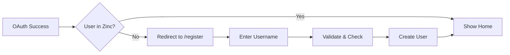
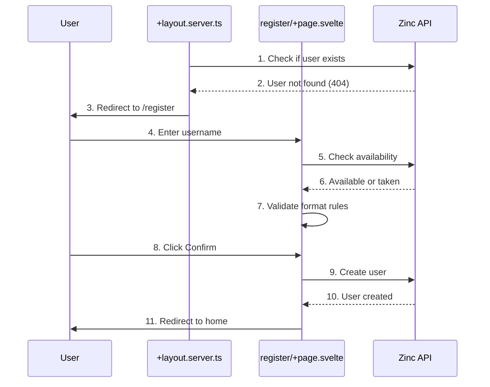

# Registration

**What**: Username selection form for new users after OAuth authentication.

**Why**: Allows users to choose their unique identifier in the CyanPrint registry after authenticating via Descope.

**Key Files**:

- `src/routes/register/+page.svelte:19-26` → Username validation rules
- `src/routes/register/+page.svelte:32-43` → `exist()` function to check availability
- `src/routes/register/+page.svelte:45-57` → `createUser()` function
- `src/routes/+layout.server.ts:31-37` → Redirect to /register when user not found in Zinc

## Overview

After OAuth authentication succeeds, Argon checks if the user exists in the Zinc database. If the user is not found (new user), they are redirected to the `/register` page to choose a unique username. The username form validates the input in real-time, checks availability via the Zinc API, and creates the user record upon confirmation.

## Flow

### High-Level

### Detailed

| #   | Step               | What                            | Why                             | Key File                                  |
| --- | ------------------ | ------------------------------- | ------------------------------- | ----------------------------------------- |
| 1   | Check user         | Query Zinc for user by OAuth ID | Determine if new or returning   | `src/routes/+layout.server.ts:25-28`      |
| 2   | Not found          | Zinc returns 404                | New user needs username         | `src/routes/+layout.server.ts:39-46`      |
| 3   | Redirect           | Navigate to /register           | Show username form              | `src/routes/+layout.server.ts:43`         |
| 4   | Enter username     | User types desired username     | Choose identifier               | `src/routes/register/+page.svelte:87-90`  |
| 5   | Check availability | API call to Zinc endpoint       | Ensure username is unique       | `src/routes/register/+page.svelte:32-43`  |
| 6   | Available response | Username availability status    | Show check/X icon               | `src/routes/register/+page.svelte:96-114` |
| 7   | Validate format    | Check username rules            | Enforce naming conventions      | `src/routes/register/+page.svelte:19-26`  |
| 8   | Click confirm      | User submits form               | Create user record              | `src/routes/register/+page.svelte:128`    |
| 9   | Create user        | POST to Zinc user endpoint      | Persist user in database        | `src/routes/register/+page.svelte:45-57`  |
| 10  | Created            | Zinc confirms creation          | User now exists                 | `src/routes/register/+page.svelte:48-56`  |
| 11  | Redirect home      | Navigate to root page           | User is now fully authenticated | `src/routes/register/+page.svelte:51`     |

## Edge Cases

- **Username taken**: Show X icon and disable confirm button
- **Invalid format**: Show validation error message (must start with letter, no trailing dashes, alphanumeric + dashes only)
- **API error**: Display problem details to user
- **Already registered**: Redirect to home if user somehow visits /register with existing username

## Validation Rules

| Rule           | Pattern                   | Error Message                                                |
| -------------- | ------------------------- | ------------------------------------------------------------ |
| Minimum length | ≥ 1 character             | Username must contain at least 1 character                   |
| Maximum length | ≤ 256 characters          | Username must be less than 256 characters                    |
| Allowed chars  | `/^[0-9a-zA-Z-]+$/`       | Username must only contain letters, numbers, and dashes      |
| Final format   | `/^[a-z](-?[a-z0-9]+)*$/` | Username must start with a letter and cannot end with dashes |

The implementation checks two patterns in sequence:

1. `/^[0-9a-zA-Z-]+$/` — Permissive check for allowed characters (alphanumeric + dashes)
2. `/^[a-z](-?[a-z0-9]+)*$/` — Stricter format check that enforces:
   - Must start with a lowercase letter (`[a-z]`)
   - Can contain lowercase letters, numbers, and single dashes (`-?[a-z0-9]+`)
   - No trailing dash (the pattern requires a letter/digit after any dash)
   - Only lowercase letters (no uppercase)

## Related

- [Authentication](./01-authentication.md) - OAuth flow that precedes registration
- [API Client](../modules/01-api-client.md) - HTTP client for Zinc API calls
