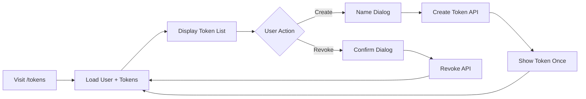
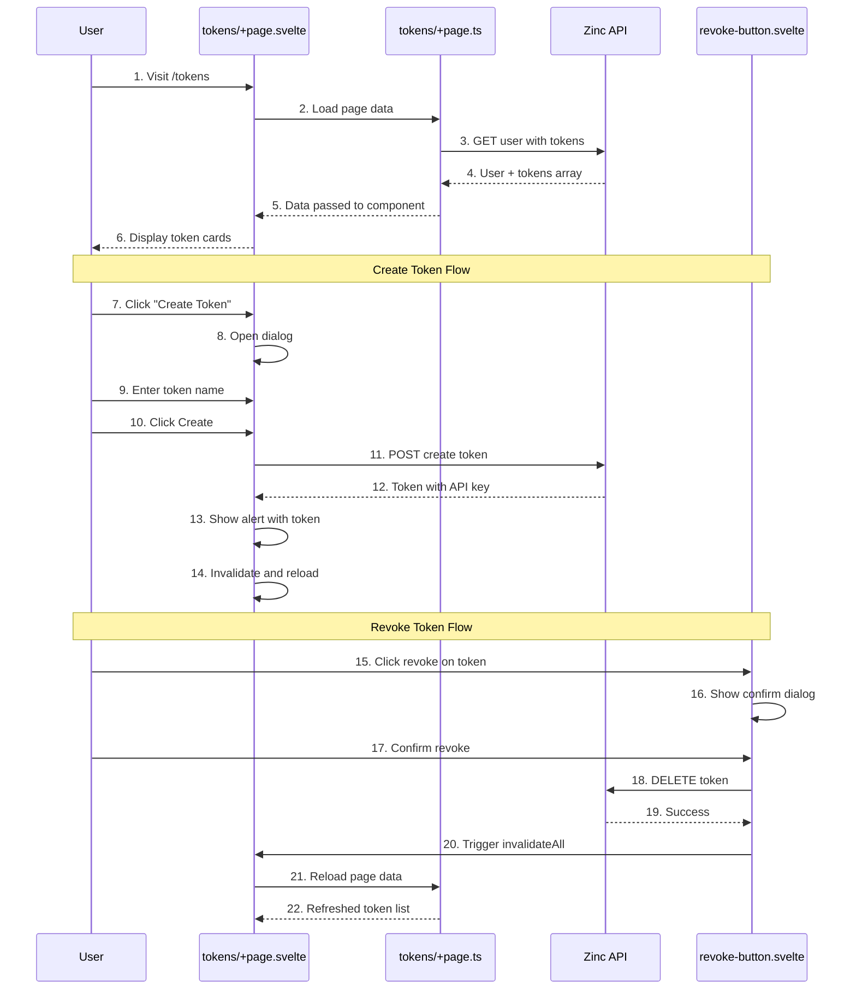

# API Token Management

**What**: Interface for generating and revoking API tokens for CLI usage.

**Why**: Enables programmatic access via CyanPrint CLI without requiring OAuth flow.

**Key Files**:

- `src/routes/tokens/+page.svelte:65-87` → `createToken()` function
- `src/routes/tokens/+page.svelte:91-95` → Token display and storage warning
- `src/lib/components/complex/revoke-button.svelte` → Token revocation component
- `src/routes/tokens/+page.ts:41-54` → User data loading with tokens

## Overview

API tokens allow users to access the CyanPrint registry programmatically (e.g., via the Iridium CLI). The tokens page displays all existing tokens, allows creating new tokens with custom names, and revoking tokens that are no longer needed. Tokens are displayed only once at creation time for security reasons.

## Flow

### High-Level

### Detailed

| #   | Step           | What                            | Why                               | Key File                                          |
| --- | -------------- | ------------------------------- | --------------------------------- | ------------------------------------------------- |
| 1   | Visit page     | User navigates to /tokens       | View and manage tokens            | `src/routes/tokens/+page.svelte`                  |
| 2   | Load data      | SvelteKit load function runs    | Fetch user and tokens from server | `src/routes/tokens/+page.ts:16-54`                |
| 3   | GET user       | Request user with tokens        | Get current token list            | `src/routes/tokens/+page.ts:41-54`                |
| 4   | User data      | Zinc returns user + tokens      | Display existing tokens           | `src/lib/api/core/Api.ts`                         |
| 5   | Pass data      | Data passed to page component   | Render UI with tokens             | `src/routes/tokens/+page.ts:16-23`                |
| 6   | Display tokens | Show token cards in grid        | User sees all tokens              | `src/routes/tokens/+page.svelte:162-181`          |
| 7   | Click create   | User clicks "Create Token"      | Open creation dialog              | `src/routes/tokens/+page.svelte:133-135`          |
| 8   | Open dialog    | Show dialog with name input     | User enters token name            | `src/routes/tokens/+page.svelte:136-158`          |
| 9   | Enter name     | User types token name           | Identify the token's purpose      | `src/routes/tokens/+page.svelte:142-143`          |
| 10  | Click create   | User submits dialog             | Initiate token creation           | `src/routes/tokens/+page.svelte:149-155`          |
| 11  | POST token     | Call Zinc create endpoint       | Generate new API key              | `src/routes/tokens/+page.svelte:65-87`            |
| 12  | Token created  | Zinc returns token with API key | Get the secret key                | `src/routes/tokens/+page.svelte:77-78`            |
| 13  | Show alert     | Display token in alert dialog   | Show token once for copying       | `src/routes/tokens/+page.svelte:110-128`          |
| 14  | Invalidate     | Reload page data                | Refresh token list                | `src/routes/tokens/+page.svelte:81`               |
| 15  | Click revoke   | User clicks revoke button       | Initiate token deletion           | `src/lib/components/complex/revoke-button.svelte` |
| 16  | Confirm dialog | Show confirmation               | Prevent accidental revocation     | `src/lib/components/complex/revoke-button.svelte` |
| 17  | Confirm revoke | User confirms deletion          | User wants to delete token        | `src/lib/components/complex/revoke-button.svelte` |
| 18  | DELETE token   | Call Zinc delete endpoint       | Remove token from database        | `src/lib/components/complex/revoke-button.svelte` |
| 19  | Success        | Zinc confirms deletion          | Token is now revoked              | `src/lib/components/complex/revoke-button.svelte` |
| 20  | Invalidate     | Trigger page refresh            | Update UI                         | `src/routes/tokens/+page.svelte:175`              |
| 21  | Reload data    | Refetch user and tokens         | Get updated list                  | `src/routes/tokens/+page.ts`                      |
| 22  | Refreshed list | Display updated tokens          | Show remaining tokens             | `src/routes/tokens/+page.svelte`                  |

## Edge Cases

- **Empty token name**: Validation prevents creation (must enter a name)
- **Name too long**: Validation prevents creation (max 256 characters)
- **Token creation fails**: Error displayed via problem store
- **Revoke fails**: Error displayed and token remains in list

## Security

- **Token shown once**: API key is only displayed immediately after creation
- **No retrieval**: There is no API to retrieve an existing token's API key
- **Immediate copy warning**: Alert dialog warns user to copy immediately

## Related

- [Authentication](./01-authentication.md) - OAuth authentication required to access tokens page
- [API Client](../modules/01-api-client.md) - HTTP client for Zinc API calls
