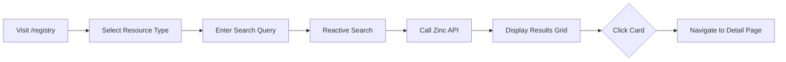
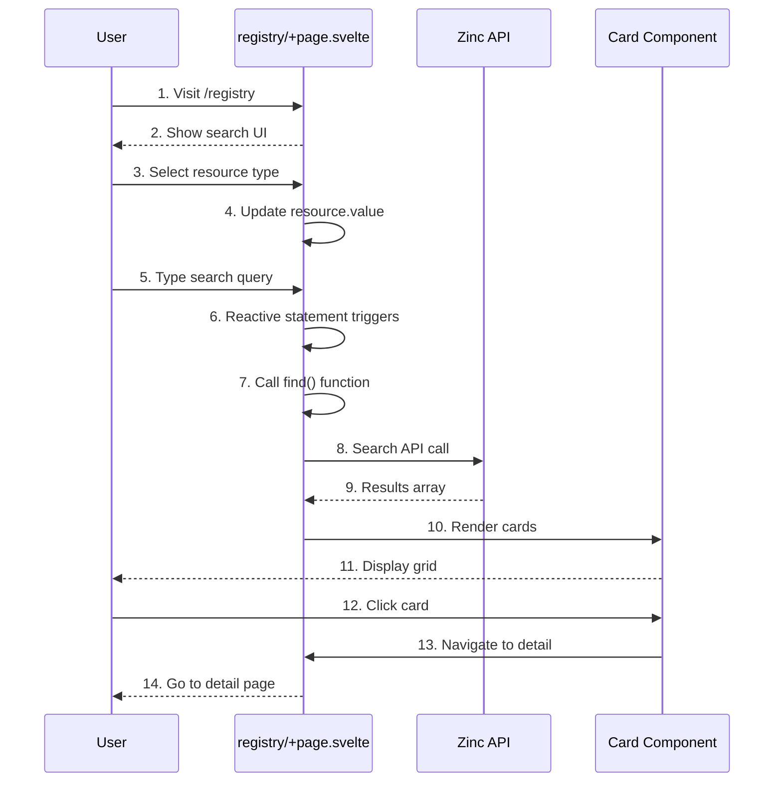

# Registry Search

**What**: Multi-resource search for Templates, Plugins, and Processors with real-time filtering.

**Why**: Users need to discover and inspect artifacts before using them.

**Key Files**:
- `src/routes/registry/+page.svelte:51-66` → `searchTemplate()` function
- `src/routes/registry/+page.svelte:68-83` → `searchPlugin()` function
- `src/routes/registry/+page.svelte:85-100` → `searchProcessor()` function
- `src/routes/registry/+page.svelte:102-113` → `find()` router function
- `src/routes/registry/+page.svelte:115` → Reactive statement for search
- `src/lib/components/cards/template.svelte` → Template card component
- `src/lib/components/cards/plugin.svelte` → Plugin card component
- `src/lib/components/cards/processor.svelte` → Processor card component

## Overview

The registry search page allows users to discover Templates, Plugins, and Processors in the CyanPrint registry. Users can select a resource type, enter a search query, and see results displayed in a grid of cards. Each card shows summary information and links to the detail page.

## Flow

### High-Level

### Detailed

| # | Step | What | Why | Key File |
|---|------|------|-----|----------|
| 1 | Visit page | User navigates to /registry | Access search interface | `src/routes/registry/+page.svelte:125-165` |
| 2 | Show UI | Render search input and dropdown | User can select and search | `src/routes/registry/+page.svelte:127-140` |
| 3 | Select type | User chooses Template/Plugin/Processor | Filter results by type | `src/routes/registry/+page.svelte:130-138` |
| 4 | Update value | resource.value changes | Triggers re-search | `src/routes/registry/+page.svelte:18-22` |
| 5 | Type query | User enters search text | Find specific resources | `src/routes/registry/+page.svelte:128-129` |
| 6 | Reactive | Svelte reactive statement fires | Auto-search on input | `src/routes/registry/+page.svelte:115` |
| 7 | Call find | Route to appropriate search function | Dispatch based on type | `src/routes/registry/+page.svelte:102-113` |
| 8 | Search API | Call Zinc search endpoint | Query registry database | `src/routes/registry/+page.svelte:51-100` |
| 9 | Results | Zinc returns matching resources | Display to user | `src/lib/api/core/Api.ts` |
| 10 | Render cards | Create card components | Show results in grid | `src/routes/registry/+page.svelte:147-161` |
| 11 | Display grid | Show cards with summaries | User can browse results | `src/lib/components/cards/` |
| 12 | Click card | User clicks on a result | View full details | `src/lib/components/cards/template.svelte` |
| 13 | Navigate | SvelteKit navigation | Go to detail page | `src/routes/registry/+page.svelte` |
| 14 | Detail page | Show full resource information | User can evaluate and use | `src/routes/templates/[user_id]/[template_id]/+page.svelte` |

## Search Functions

| Function | Resource Type | API Endpoint |
|----------|--------------|--------------|
| `searchTemplate()` | Templates | `vTemplateDetail()` |
| `searchPlugin()` | Plugins | `vPluginDetail()` |
| `searchProcessor()` | Processors | `vProcessorDetail()` |

All search functions:
- Accept `searchTerm` and `limit` parameters
- Return arrays of principal responses
- Set `problem` store on error
- Track `queue` for loading state

## Edge Cases

- **No results**: Shows "No Xs found" message
- **API error**: Displays problem details
- **Empty search**: Returns all resources (up to limit)
- **Loading**: Shows loading spinner while queue > 0

## Related

- [Resource Details](./06-resource-details.md) - Detail pages for search results
- [API Client](../modules/01-api-client.md) - HTTP client for Zinc API calls
