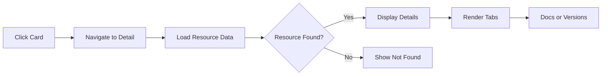
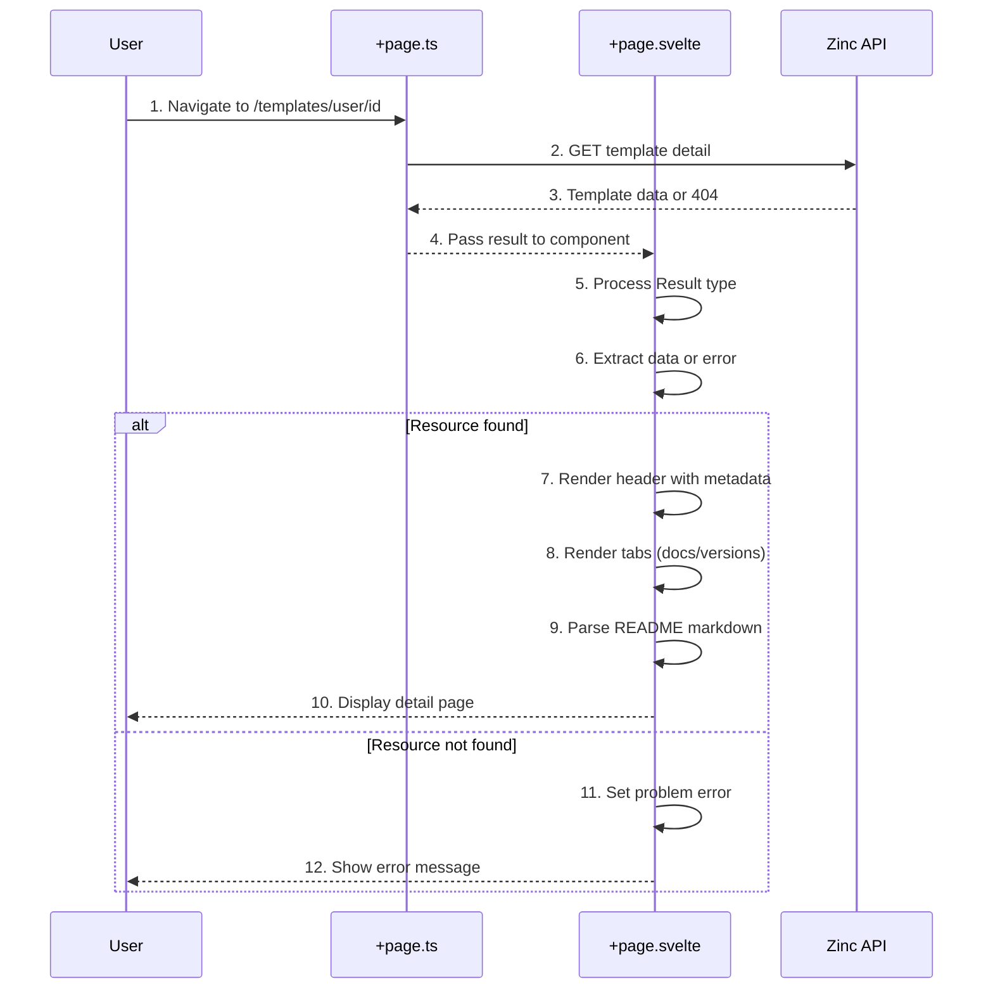

# Resource Details

**What**: Individual pages for Templates, Plugins, and Processors with full metadata and documentation.

**Why**: Users need detailed information to evaluate and use resources.

**Key Files**:
- `src/routes/templates/[user_id]/[template_id]/+page.ts` → Template data loading
- `src/routes/plugins/[user_id]/[plugin_id]/+page.ts` → Plugin data loading
- `src/routes/processors/[user_id]/[processor_id]/+page.ts` → Processor data loading
- `src/routes/templates/[user_id]/[template_id]/+page.svelte` → Template detail UI
- `src/routes/plugins/[user_id]/[plugin_id]/+page.svelte` → Plugin detail UI
- `src/routes/processors/[user_id]/[processor_id]/+page.svelte` → Processor detail UI

## Overview

Resource detail pages display comprehensive information about a specific Template, Plugin, or Processor. Each page shows metadata (name, description, tags, author), statistics (stars, downloads), links (project homepage, source code), documentation (README), and version history.

## Flow

### High-Level

### Detailed

| # | Step | What | Why | Key File |
|---|------|------|-----|----------|
| 1 | Navigate | User clicks card or types URL | Access specific resource | `src/routes/templates/[user_id]/[template_id]/+page.ts` |
| 2 | GET detail | Load function calls Zinc API | Fetch resource data | `src/routes/templates/[user_id]/[template_id]/+page.ts:16-41` |
| 3 | Data or 404 | Zinc returns resource or error | Determine if exists | `src/lib/api/core/Api.ts` |
| 4 | Pass result | Serialized result passed to page | Transfer server to client | `src/routes/templates/[user_id]/[template_id]/+page.ts:43-44` |
| 5 | Process Result | Deserialize and unwrap | Extract data or error | `src/routes/templates/[user_id]/[template_id]/+page.svelte:21-31` |
| 6 | Extract data | Get template object or null | Use in template | `src/routes/templates/[user_id]/[template_id]/+page.svelte:33-40` |
| 7 | Render header | Show title, description, tags | Display key info | `src/routes/templates/[user_id]/[template_id]/+page.svelte:51-68` |
| 8 | Render tabs | Create docs and versions tabs | Organize content | `src/routes/templates/[user_id]/[template_id]/+page.svelte:98-151` |
| 9 | Parse README | Convert markdown to HTML | Show documentation | `src/routes/templates/[user_id]/[template_id]/+page.svelte:109` |
| 10 | Display page | Show full detail view | User evaluates resource | `src/routes/templates/[user_id]/[template_id]/+page.svelte:48-155` |
| 11 | Set error | Store problem details | Show error UI | `src/routes/templates/[user_id]/[template_id]/+page.svelte:28-30` |
| 12 | Show error | Display error message | User knows what failed | `src/lib/components/complex/page.svelte` |

## Page Structure

Each detail page has the following sections:

### Header
- **Title**: `{username}/{resource_name}`
- **Description**: Resource description
- **Tags**: Array of tags as badges
- **Links**: Project homepage, source repository
- **Stats**: Stars, downloads

### Tabs

#### Documentation Tab
- **README**: Markdown rendered as HTML
- **Full content**: Complete resource documentation

#### Versions Tab
- **Version table**: Version, description, created date
- **Search filter**: Filter versions by description
- **Sortable**: Sorted by version (newest first)

## Resource Types

| Type | Route | Load Function | Component |
|------|-------|---------------|------------|
| Template | `/templates/[user_id]/[template_id]` | `+page.ts` → `vTemplateUserTemplateDetail()` | `+page.svelte` |
| Plugin | `/plugins/[user_id]/[plugin_id]` | `+page.ts` → `vPluginUserPluginDetail()` | `+page.svelte` |
| Processor | `/processors/[user_id]/[processor_id]` | `+page.ts` → `vProcessorUserProcessorDetail()` | `+page.svelte` |

## Edge Cases

- **Resource not found**: Shows "Template not found" message
- **API error**: Displays problem details with error information
- **Missing README**: Docs tab shows empty content
- **No versions**: Versions table shows empty state

## Related

- [Registry Search](./05-registry-search.md) - How users find resources
- [API Client](../modules/01-api-client.md) - HTTP client for Zinc API calls
