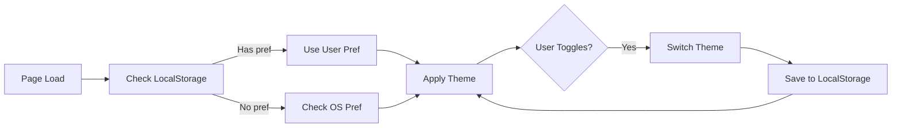
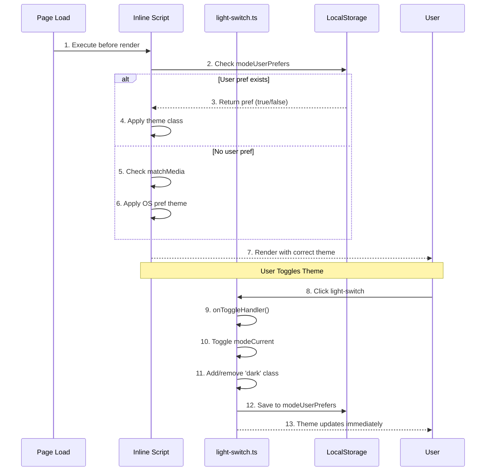

# Dark Mode

**What**: Theme switching between light and dark modes with OS preference detection.

**Why**: Improves user experience in different lighting conditions and personal preference.

**Key Files**:
- `src/lib/components/ui/light-switch/light-switch.svelte:16-20` → `onToggleHandler()` function
- `src/lib/components/ui/light-switch/light-switch.svelte:32-37` → OS preference sync on mount
- `src/lib/components/ui/light-switch/local-storage-store.ts` → LocalStorage persistence
- `src/routes/+layout.svelte:19` → Inline script for initial theme state

## Overview

Argon supports light and dark themes that users can toggle manually. The theme preference is persisted in LocalStorage and syncs with the OS's preferred color scheme. An inline script runs before page load to prevent "flash of wrong theme" (FOUC).

## Flow

### High-Level

### Detailed

| # | Step | What | Why | Key File |
|---|------|------|-----|----------|
| 1 | Page load | Browser starts rendering HTML | Prevent FOUC | `src/routes/+layout.svelte:17-20` |
| 2 | Check storage | Read modeUserPrefers from LocalStorage | Get saved preference | `src/lib/components/ui/light-switch/light-switch.ts:59-75` |
| 3 | User pref | Return saved true/false value | Use user's choice | `src/lib/components/ui/light-switch/local-storage-store.ts` |
| 4 | Apply theme | Add/remove 'dark' class on html | Set visual theme | `src/lib/components/ui/light-switch/light-switch.ts:49-54` |
| 5 | Check OS | Use matchMedia for dark mode | Fallback to system pref | `src/lib/components/ui/light-switch/light-switch.ts:22-26` |
| 6 | Apply OS | Use system preference | Match user's OS setting | `src/lib/components/ui/light-switch/light-switch.ts:34-39` |
| 7 | Render | Page displays with correct theme | No visual flash | `src/routes/+layout.svelte` |
| 8 | Click toggle | User clicks sun/moon icon | Change theme | `src/lib/components/ui/light-switch/light-switch.svelte` |
| 9 | Handler | onToggleHandler executes | Process toggle | `src/lib/components/ui/light-switch/light-switch.svelte:16-20` |
| 10 | Toggle mode | Flip modeCurrent value | Invert current state | `src/lib/components/ui/light-switch/light-switch.ts:49-54` |
| 11 | Update class | Add/remove 'dark' on html element | Change CSS variables | `src/lib/components/ui/light-switch/light-switch.ts:50-52` |
| 12 | Save pref | Store in LocalStorage | Persist across sessions | `src/lib/components/ui/light-switch/local-storage-store.ts` |
| 13 | Update UI | Theme changes immediately | Visual feedback | `src/lib/components/ui/light-switch/light-switch.svelte` |

## Theme Stores

| Store | Type | Purpose |
|-------|------|---------|
| `modeOsPrefers` | `boolean` | OS's preferred color scheme (light=true, dark=false) |
| `modeUserPrefers` | `boolean \| undefined` | User's explicit preference (undefined = use OS) |
| `modeCurrent` | `boolean` | Currently active theme (light=true, dark=false) |

## Key Functions

| Function | Purpose | Key File |
|----------|---------|----------|
| `setInitialClassState()` | Apply theme before render (prevents FOUC) | `src/lib/components/ui/light-switch/light-switch.ts:59-75` |
| `getModeOsPrefers()` | Get OS color scheme preference | `src/lib/components/ui/light-switch/light-switch.ts:22-26` |
| `getModeAutoPrefers()` | Get auto preference (user or OS) | `src/lib/components/ui/light-switch/light-switch.ts:34-39` |
| `setModeUserPrefers()` | Save user's explicit preference | `src/lib/components/ui/light-switch/light-switch.ts:44-46` |
| `setModeCurrent()` | Apply theme to DOM | `src/lib/components/ui/light-switch/light-switch.ts:49-54` |
| `autoModeWatcher()` | Watch for OS preference changes | `src/lib/components/ui/light-switch/light-switch.ts:80-99` |

## Edge Cases

- **No LocalStorage**: Falls back to OS preference
- **LocalStorage cleared**: Reverts to OS preference on next visit
- **OS changes**: Theme updates if no user preference set

## FOUC Prevention

The inline script in `src/routes/+layout.svelte:17-20` executes immediately when the page loads, before any JavaScript bundles. This ensures the correct theme class is applied before the browser paints, preventing the "flash of wrong theme."

## Related

- [UI Components](../modules/02-ui-components.md) - Component library including light-switch
