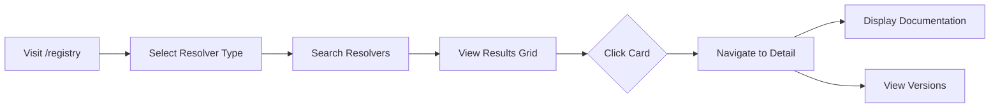
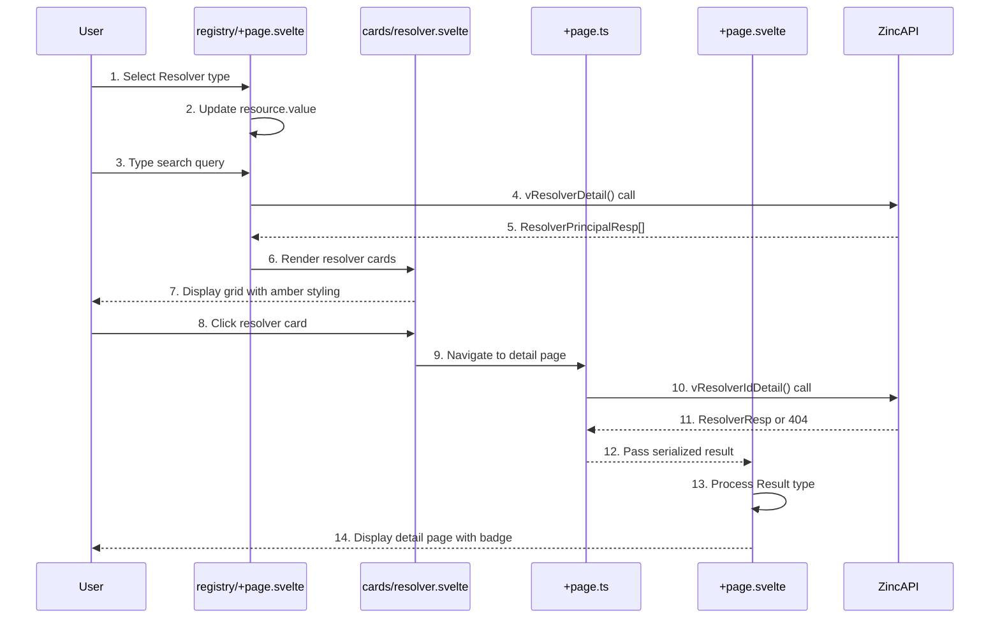

# Resolver UI

**What**: UI components for browsing, viewing, and managing resolvers in the CyanPrint registry.

**Why**: Users need to discover and inspect resolvers before using them in templates.

**Key Files**:

- `src/lib/components/cards/resolver.svelte` → Resolver summary card for registry grid
- `src/routes/resolvers/[user_id]/[resolver_id]/+page.ts` → Resolver data loading
- `src/routes/resolvers/[user_id]/[resolver_id]/+page.svelte` → Resolver detail UI
- `src/routes/registry/+page.svelte` → Registry search with resolver support

## Overview

Resolver UI provides components for displaying resolver resources in the Argon application. This includes:

- **Resolver Card**: Summary card displayed in the registry grid
- **Resolver Detail Page**: Full information page with documentation and versions

Resolvers are distinguished by their amber color scheme (`text-amber-600`, `border-amber-600`, etc.).

## Flow

### High-Level



### Detailed



| #   | Step           | What                             | Why                       | Key File                                                           |
| --- | -------------- | -------------------------------- | ------------------------- | ------------------------------------------------------------------ |
| 1   | Select type    | User chooses Resolver from menu  | Filter to resolvers only  | `src/routes/registry/+page.svelte`                                 |
| 2   | Update value   | resource.value changes           | Triggers re-search        | `src/routes/registry/+page.svelte`                                 |
| 3   | Type query     | User enters search text          | Find specific resolvers   | `src/routes/registry/+page.svelte`                                 |
| 4   | Search API     | Call vResolverDetail endpoint    | Query registry database   | `src/routes/registry/+page.svelte:117-135`                         |
| 5   | Results        | Zinc returns matching resolvers  | Display to user           | `src/lib/api/core/Api.ts`                                          |
| 6   | Render cards   | Create resolver card components  | Show results in grid      | `src/routes/registry/+page.svelte:198-201`                         |
| 7   | Display grid   | Show cards with amber styling    | User can browse results   | `src/lib/components/cards/resolver.svelte`                         |
| 8   | Click card     | User clicks on a result          | View full details         | `src/lib/components/cards/resolver.svelte:10`                      |
| 9   | Navigate       | SvelteKit navigation to detail   | Go to detail page         | `src/routes/resolvers/[user_id]/[resolver_id]/+page.ts`            |
| 10  | GET detail     | Load function calls Zinc API     | Fetch resolver data       | `src/routes/resolvers/[user_id]/[resolver_id]/+page.ts:17-20`      |
| 11  | Data or 404    | Zinc returns resource or error   | Determine if exists       | `src/lib/api/core/Api.ts`                                          |
| 12  | Pass result    | Serialized result passed to page | Transfer server to client | `src/routes/resolvers/[user_id]/[resolver_id]/+page.ts:21-23`      |
| 13  | Process Result | Deserialize and unwrap           | Extract data or error     | `src/routes/resolvers/[user_id]/[resolver_id]/+page.svelte:22-34`  |
| 14  | Display page   | Show detail with Resolver badge  | User evaluates resource   | `src/routes/resolvers/[user_id]/[resolver_id]/+page.svelte:51-165` |

## Components

### Resolver Card

Summary card displayed in the registry grid with amber color scheme.

**Key File**: `src/lib/components/cards/resolver.svelte`

```svelte
<a href="/resolvers/{resolver.userId}/{resolver.id}">
    <Card.Root class="... amber gradient styling ...">
        <Card.Header>
            <Card.Title>{resolver.name}</Card.Title>
            <Card.Description>{resolver.description}</Card.Description>
        </Card.Header>
        <Card.Footer>
            <p>{resolver.email}</p>
            <!-- Project and Source links -->
        </Card.Footer>
    </Card.Root>
</a>
```

**Props**:

- `resolver: ResolverPrincipalResp` — Resolver summary data from API

**Styling**:

- Amber gradient background: `from-amber-50/30 to-transparent dark:from-amber-950/20`
- Amber hover shadow: `hover:shadow-amber-200/50 dark:hover:shadow-amber-900/30`
- Amber border on hover: `hover:border-amber-200 dark:hover:border-amber-800`
- Amber title on hover: `group-hover:text-amber-600`

### Resolver Detail Page

Full information page with documentation and version tabs.

**Key Files**:

- `src/routes/resolvers/[user_id]/[resolver_id]/+page.ts` — Data loading
- `src/routes/resolvers/[user_id]/[resolver_id]/+page.svelte` — UI component

**Page Structure**:

#### Header

- **Title**: `{username}/{resolver_name}`
- **Type Badge**: "Resolver" badge with amber styling
- **Description**: Resolver description
- **Tags**: Array of tags as badges
- **Links**: Project homepage, source repository

#### Stats Bar

- **Stars**: Star count with star icon
- **Downloads**: Download count with download icon
- **Dependencies**: Dependency count with workflow icon

#### Tabs

##### Documentation Tab

- **README**: Markdown rendered as HTML via `SvelteMarkdown`

##### Versions Tab

- **Version table**: Version, description, created date
- **Search filter**: Filter versions by description
- **Sortable**: Sorted by version (newest first)

## Type Badge Colors

| Type     | Color Class                       |
| -------- | --------------------------------- |
| Resolver | `text-amber-600 border-amber-600` |

The Resolver badge uses the outline variant:

```svelte
<Badge variant="outline" class="text-amber-600 border-amber-600">Resolver</Badge>
```

## Edge Cases

- **Resolver not found**: Shows "Resolver not found" message via Page component
- **API error**: Displays problem details with error information
- **Missing README**: Docs tab shows empty content
- **No versions**: Versions table shows empty state
- **Missing tags**: Tags section gracefully handles empty/null array

## Related

- [Registry Search](./05-registry-search.md) - How users find resolvers
- [Resource Details](./06-resource-details.md) - Detail pages for all resource types
- [UI Components](../modules/02-ui-components.md) - Card component documentation
