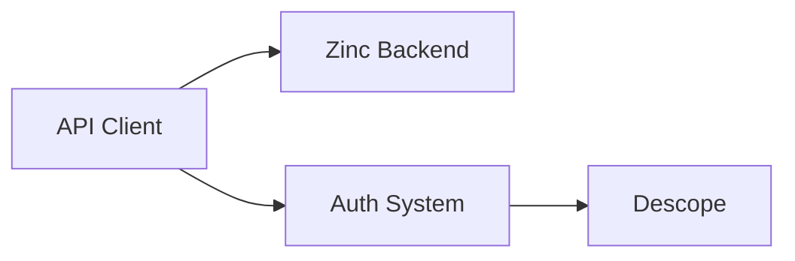

# API Client

**What**: Auto-generated TypeScript client for Zinc backend API with auth injection.

**Why**: Provides type-safe API access that stays in sync with backend changes.

**Key Files**:

- `src/store.ts:17-36` → `NewApi()` factory function
- `src/store.ts:38-56` → Client-side API store with auto sign-in
- `src/lib/api/core/Api.ts` → Auto-generated API client class
- `src/lib/api/core/http-client.ts` → HTTP fetch wrapper
- `src/lib/api/core/data-contracts.ts` → TypeScript interfaces
- `scripts/local/sdk_gen.sh` → API generation script

## Responsibilities

- Type-safe HTTP communication with Zinc backend
- Automatic JWT token injection into Authorization headers
- Token expiration checking and auto sign-in
- Request/response type definitions
- Error handling and problem details

## Structure

```
src/lib/api/core/
├── Api.ts              # Main API client class (auto-generated)
├── http-client.ts      # Base HTTP fetch wrapper
└── data-contracts.ts   # TypeScript interfaces (auto-generated)
```

| File                | Purpose                                                    |
| ------------------- | ---------------------------------------------------------- |
| `Api.ts`            | Generated API methods (vTemplateDetail, vUserCreate, etc.) |
| `http-client.ts`    | Base fetch wrapper with security worker                    |
| `data-contracts.ts` | Request/response type definitions                          |

## Dependencies



| Dependency   | Why                              |
| ------------ | -------------------------------- |
| Zinc Backend | Provides REST API to consume     |
| Auth System  | Provides JWT tokens for requests |

| Dependent    | Why                                     |
| ------------ | --------------------------------------- |
| All Features | Use API client to communicate with Zinc |

## Key Interfaces

### `ApiConfig`

Configuration for the API client.

**Key File**: `src/lib/api/core/http-client.ts:36-41`

```typescript
export interface ApiConfig<SecurityDataType = unknown> {
  baseUrl?: string;
  baseApiParams?: Omit<RequestParams, 'baseUrl' | 'cancelToken' | 'signal'>;
  securityWorker?: (securityData: SecurityDataType | null) => Promise<RequestParams | void> | RequestParams | void;
  customFetch?: typeof fetch;
}
```

### `HttpClient`

Base HTTP client class that wraps fetch.

**Key File**: `src/lib/api/core/http-client.ts:57-215`

- Handles query parameter encoding
- Manages request cancellation
- Supports multiple content types (JSON, FormData, etc.)
- Applies security worker for auth injection

## API Client Factory

### `NewApi()`

Creates a new API client instance for server-side use.

**Key File**: `src/store.ts:17-36`

```typescript
export function NewApi({ data, fetch }: { data?: any; fetch?: any }): Api;
```

- Uses provided `data` for session access
- Uses provided `fetch` for SvelteKit server context
- Returns configured `Api` instance

### Client API Store

Client-side writable store with auto sign-in.

**Key File**: `src/store.ts:38-56`

- Checks token expiration before each request
- Triggers `signIn('descope')` if token expired
- Automatically adds Authorization header with JWT

## API Generation

The API client is generated from Zinc's OpenAPI specification.

**Key File**: `scripts/local/sdk_gen.sh`

```bash
pls sdk-gen
```

This:

1. Fetches OpenAPI spec from Zinc
2. Runs `swagger-typescript-api`
3. Generates `Api.ts` and `data-contracts.ts`
4. Updates `http-client.ts` base file

**Do not edit** generated files directly - they will be overwritten.

## Security Worker

The `securityWorker` function injects auth headers.

**Key File**: `src/store.ts:20-30`

```typescript
securityWorker: async () => {
  const s = data?.session;
  if (s && s?.access_token != null && !expired(s.access_token, new Date())) {
    return {
      headers: {
        Authorization: `Bearer ${s.access_token}`,
      },
    };
  }
  return {};
};
```

## Related

- [Authentication](../features/01-authentication.md) - How JWT tokens are obtained
- [Token Refresh](../features/02-token-refresh.md) - Token expiration handling
