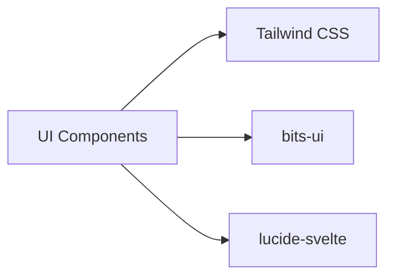

# UI Components

**What**: shadcn-svelte base components and custom domain-specific components.

**Why**: Provides accessible, customizable UI components with consistent styling.

**Key Files**:

- `src/lib/components/ui/` → shadcn-svelte base components
- `src/lib/components/cards/` → Domain-specific resource cards
- `src/lib/components/complex/` → Composed components with complex behavior
- `src/lib/components/custom/` → Business-specific components

## Responsibilities

- Reusable UI primitives (buttons, inputs, dialogs, etc.)
- Domain-specific display components (template/plugin/processor cards)
- Complex composed components (page wrapper, error display, loading states)
- Application-specific components (navigation, account dropdown)

## Structure

```
src/lib/components/
├── ui/               # shadcn-svelte base components
│   ├── button/
│   ├── card/
│   ├── dialog/
│   ├── input/
│   └── ...
├── cards/            # Domain-specific resource cards
│   ├── template.svelte
│   ├── plugin.svelte
│   └── processor.svelte
├── complex/          # Composed components
│   ├── page.svelte
│   ├── error.svelte
│   ├── loader.svelte
│   └── revoke-button.svelte
└── custom/           # Business-specific components
    ├── main-nav/
    └── account/
```

| Folder     | Purpose                                                                       |
| ---------- | ----------------------------------------------------------------------------- |
| `ui/`      | Base components from shadcn-svelte (auto-generated via `pls add <component>`) |
| `cards/`   | Resource summary cards for registry items                                     |
| `complex/` | Multi-purpose components with state management                                |
| `custom/`  | Application-specific business logic components                                |

## Dependencies



| Dependency    | Why                           |
| ------------- | ----------------------------- |
| Tailwind CSS  | Utility-first styling         |
| bits-ui       | Headless component primitives |
| lucide-svelte | Icon library                  |

| Dependent | Why                         |
| --------- | --------------------------- |
| All Pages | Use components to render UI |

## Component Categories

### UI Components (`ui/`)

Base components from shadcn-svelte. Auto-generated via `pls add <component>`.

| Component     | Purpose                                |
| ------------- | -------------------------------------- |
| Button        | Clickable action trigger               |
| Card          | Container with header, content, footer |
| Dialog        | Modal overlay                          |
| Input         | Text input field                       |
| Select        | Dropdown selection                     |
| Table         | Data table                             |
| Tabs          | Tabbed content                         |
| Avatar        | User profile image                     |
| Badge         | Small status indicator                 |
| Dropdown Menu | Menu of actions                        |
| Alert Dialog  | Confirmation dialog                    |
| Label         | Form field label                       |
| Tooltip       | Hover information                      |
| Accordion     | Collapsible sections                   |
| Light Switch  | Dark mode toggle                       |

**Key File**: `src/lib/components/ui/*/index.ts`

### Cards (`cards/`)

Domain-specific components for displaying registry resources.

| Component | Purpose                | Key File                                    |
| --------- | ---------------------- | ------------------------------------------- |
| Template  | Template summary card  | `src/lib/components/cards/template.svelte`  |
| Plugin    | Plugin summary card    | `src/lib/components/cards/plugin.svelte`    |
| Processor | Processor summary card | `src/lib/components/cards/processor.svelte` |

Each card displays:

- Resource name and author
- Short description
- Tags
- Click to navigate to detail page

### Complex Components (`complex/`)

Composed components with complex behavior and state management.

| Component     | Purpose                                | Key File                                          |
| ------------- | -------------------------------------- | ------------------------------------------------- |
| Page          | Page wrapper with loading/error states | `src/lib/components/complex/page.svelte`          |
| Error         | Animated error display                 | `src/lib/components/complex/error.svelte`         |
| Loader        | Loading spinner animation              | `src/lib/components/complex/loader.svelte`        |
| Revoke Button | Token revocation with confirmation     | `src/lib/components/complex/revoke-button.svelte` |

### Custom Components (`custom/`)

Business-specific components for application functionality.

| Component | Purpose                             | Key File                                           |
| --------- | ----------------------------------- | -------------------------------------------------- |
| Main Nav  | Primary navigation menu             | `src/lib/components/custom/main-nav/nav.svelte`    |
| Account   | User account dropdown with sign out | `src/lib/components/custom/account/account.svelte` |

## Key Interfaces

### Page Component Props

Wrapper for pages with loading and error states.

**Key File**: `src/lib/components/complex/page.svelte`

```typescript
export let notFoundMessage: string;
export let empty: boolean;
export let problem: ProblemDetails | null;
export let queue: number;
```

### Revoke Button Props

Button for revoking API tokens.

**Key File**: `src/lib/components/complex/revoke-button.svelte`

```typescript
export let token: TokenResp;
export let callback: () => void;
```

## Related

- [Dark Mode](../features/07-dark-mode.md) - Light switch component usage
