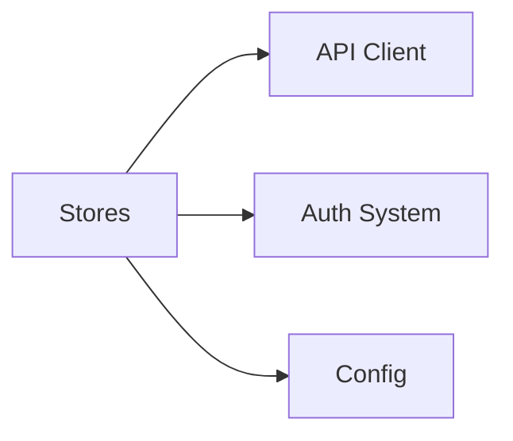

# Stores

**What**: Auth state, API client initialization, and global state management.

**Why**: Centralizes authentication state and API client configuration for use across the application.

**Key Files**:
- `src/store.ts:12` → `problem` writable store for error state
- `src/store.ts:14` → `loading` writable store for loading state
- `src/store.ts:17-36` → `NewApi()` factory function
- `src/store.ts:38-56` → Client-side API store with auto sign-in

## Responsibilities

- Global error state management
- Global loading state management
- API client initialization and configuration
- JWT token injection for authenticated requests
- Token expiration checking and auto sign-in

## Structure

```
src/store.ts
├── problem           # Writable<ProblemDetails | null>
├── loading           # Writable<boolean>
├── NewApi()          # Factory for server-side API client
└── api               # Writable<Api> for client-side
```

| Export | Type | Purpose |
|--------|------|---------|
| `problem` | `Writable<ProblemDetails \| null>` | Global error state |
| `loading` | `Writable<boolean>` | Global loading state |
| `NewApi` | `function` | Create API client for server-side use |
| `api` | `Writable<Api>` | Client-side API store |

## Dependencies



| Dependency | Why |
|------------|-----|
| API Client | Api class that we configure and store |
| Auth System | Session data for security worker |
| Config | API baseUrl configuration |

| Dependent | Why |
|-----------|-----|
| All Features | Access API client via `get(api)` |
| Error Handling | Set problem store on errors |

## Key Interfaces

### `problem` Store

Global error state for displaying problem details to users.

**Key File**: `src/store.ts:12`

```typescript
export const problem: Writable<ProblemDetails | null> = writable(null);
```

Components can:
- Subscribe: `$problem` to get current error
- Update: `problem.set(error)` to show error
- Clear: `problem.set(null)` to dismiss

### `loading` Store

Global loading state for showing loading indicators.

**Key File**: `src/store.ts:14`

```typescript
export const loading: Writable<boolean> = writable(false);
```

### `NewApi()` Factory

Creates API client for server-side use (in load functions).

**Key File**: `src/store.ts:17-36`

```typescript
export function NewApi({ data, fetch }: { data?: any; fetch?: any }): Api
```

**Parameters**:
- `data`: SvelteKit load function data (contains session)
- `fetch`: SvelteKit fetch for server-side requests

**Returns**: Configured `Api` instance

### `api` Store

Client-side API store with automatic auth injection.

**Key File**: `src/store.ts:38-56`

```typescript
export const api = writable(new Api({
  baseUrl: `${config.api.scheme}://${config.api.domain}`,
  securityWorker: async () => {
    // ... token injection logic
  }
}));
```

**Security Worker**:
- Checks for valid session
- Validates token expiration
- Returns Authorization header or redirects to login

## Usage Patterns

### Server-Side (in `+page.ts` / `+page.server.ts`)

```typescript
import { NewApi } from '../../store';

export async function load({ fetch, data }) {
  const api = NewApi({ data, fetch });
  const result = await api.vTemplateDetail('1', { Search: '', Limit: 10 });
  return { result };
}
```

### Client-Side (in `.svelte` components)

```typescript
import { api, problem } from '../../store';
import { get } from 'svelte/store';

const a = get(api);
const result = await a.vTemplateDetail('1', { Search: '', Limit: 10 });
```

## Token Expiration Handling

The API store's security worker checks token expiration before each request.

**Key File**: `src/store.ts:43-45`

```typescript
if (s != null && (s.access_token == null || expired(s.access_token, new Date()))) {
  await signIn('descope');
}
```

If token is expired or missing, user is redirected to Descope for re-authentication.

## Related

- [Authentication](../features/01-authentication.md) - How tokens are obtained
- [Token Refresh](../features/02-token-refresh.md) - Expiration checking logic
- [API Client](./01-api-client.md) - Api class configuration
