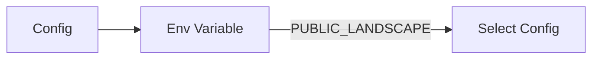

# Config

**What**: Multi-environment (landscape) configuration for development, staging, and production.

**Why**: Supports different API endpoints and auth credentials per environment.

**Key Files**:

- `src/config/shared/index.ts:1-17` → Landscape config selection
- `src/config/shared/pichu.config.ts` → Development config
- `src/config/shared/pikachu.config.ts` → Staging config
- `src/config/shared/raichu.config.ts` → Production config
- `src/config/shared/lapras.config.ts` → Local config

## Responsibilities

- Environment-specific configuration (API endpoints, auth credentials)
- Type-safe config access via TypeScript interface
- Compile-time config inclusion (only selected landscape bundled)
- Client/server/shared config separation

## Structure

```text
src/config/
├── client/          # Browser-accessible (PUBLIC_ prefixed)
│   ├── index.ts
│   ├── pichu.config.ts
│   ├── pikachu.config.ts
│   ├── raichu.config.ts
│   └── lapras.config.ts
├── server/          # Server-only (can include secrets)
│   ├── index.ts
│   ├── pichu.config.ts
│   ├── pikachu.config.ts
│   ├── raichu.config.ts
│   └── lapras.config.ts
└── shared/          # Used by both client and server
    ├── index.ts
    ├── config.ts    # Type definitions
    ├── pichu.config.ts
    ├── pikachu.config.ts
    ├── raichu.config.ts
    └── lapras.config.ts
```

| Folder    | Purpose                               | Prefix                 |
| --------- | ------------------------------------- | ---------------------- |
| `client/` | Browser-accessible config             | `PUBLIC_`              |
| `server/` | Server-only config (can have secrets) | None                   |
| `shared/` | Used by both contexts                 | `PUBLIC_` if in client |

## Dependencies



| Dependency         | Why                                          |
| ------------------ | -------------------------------------------- |
| `PUBLIC_LANDSCAPE` | Environment variable to select active config |

| Dependent   | Why                                        |
| ----------- | ------------------------------------------ |
| API Client  | Uses `config.api.domain` for baseUrl       |
| Auth System | Uses `config.auth` for Descope credentials |

## Key Interfaces

### `ISharedConfig`

Type definition for shared configuration.

**Key File**: `src/config/shared/config.ts:1-21`

```typescript
interface ISharedConfig {
  app: {
    landscape: string;
    platform: string;
    service: string;
    module: string;
    version: string;
  };
  errorPortal: {
    enabled: boolean;
    scheme: 'http' | 'https';
    host: string;
  };
  api: {
    domain: string;
    scheme: string;
  };
}
```

### Config Selection

Landscape is selected via `PUBLIC_LANDSCAPE` environment variable.

**Key File**: `src/config/shared/index.ts:1-17`

```typescript
import { PUBLIC_LANDSCAPE } from '$env/static/public';

const reg: { [s: string]: ISharedConfig } = {
  lapras,
  pichu,
  pikachu,
  raichu,
};

const config: ISharedConfig = reg[PUBLIC_LANDSCAPE];
export { config };
```

**Important**: `PUBLIC_LANDSCAPE` is a SvelteKit static environment variable that must be set at **build time**. Valid values are:

- `lapras` — Local development
- `pichu` — Development environment
- `pikachu` — Staging environment
- `raichu` — Production environment

If `PUBLIC_LANDSCAPE` is unset or contains an invalid value, `config` will be `undefined` and will cause runtime errors. Ensure this variable is always set during the build process.

## Landscapes

| Landscape | Name        | Purpose                |
| --------- | ----------- | ---------------------- |
| `lapras`  | Local       | Local development      |
| `pichu`   | Development | Dev environment        |
| `pikachu` | Staging     | Staging environment    |
| `raichu`  | Production  | Production environment |

## Environment Variable

Set the landscape at build time:

```bash
export PUBLIC_LANDSCAPE=lapras  # or pichu, pikachu, raichu
```

## Config Properties

Each landscape config includes:

### App Metadata

- `landscape`: Landscape name
- `platform`: Platform identifier
- `service`: Service name (argon)
- `module`: Module name
- `version`: Current version

### Error Portal

- `enabled`: Whether error portal is active
- `scheme`: HTTP or HTTPS
- `host`: Error portal hostname

### API Configuration

- `domain`: Zinc API domain
- `scheme`: HTTP or HTTPS

### Auth Configuration (server-only, not in ISharedConfig)

These properties are in `src/config/server/*.ts` only and cannot be accessed from client code:

- `clientId`: Descope project ID
- `clientSecret`: Descope project secret
- `secret`: Session encryption secret

**Note**: Attempting to access `config.auth.clientId` from a shared-config import will fail. Use server config imports for auth properties.

## Usage

### Import in Client Code

Use a relative path from your file to the shared config:

```typescript
import { config } from './config/shared'; // Adjust path based on your file location

const apiUrl = `${config.api.scheme}://${config.api.domain}`;
```

### Import in Server Code

For server-only code that needs auth credentials:

```typescript
import { config } from './config/server'; // Adjust path based on your file location

const descopeIssuer = `https://api.descope.com/${config.auth.clientId}`;
```

**Note**: The project uses relative imports for config. You can add a `$config` alias in `svelte.config.js` under `kit.alias` for cleaner imports if desired.

## Related

- [Getting Started](../01-getting-started.md) - How to set up environment
